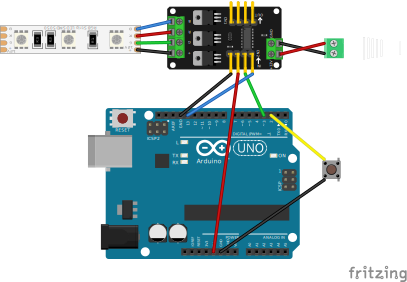

# Lights client

This client can 
- connect ot wifi
- connect to server https://github.com/anton-panfilov/lights_control_server
- set the color received from the server on the loop

https://github.com/anton-panfilov/lights_client/blob/main/src/RGB_Simple_Driver.ino#L1-L72

https://github.com/stevemar/code-reference-in-readme/blob/031e04f922c14ecd5b03a79d8c979ba8f3ab1e39/src/main.py#L1-L6