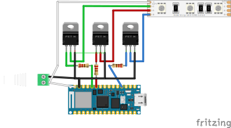

# Lights client

This code works with ESP32 and SAMD

### Setup
- **Connect to WiFi**: The client can connect to a WiFi network by inputting the WiFi credentials through a serial console during the initial setup.

### Loop
- It connects to the "get color" endpoint (https://github.com/anton-panfilov/lights_control_server).
- To sets the color received from the server

### Scheme

### Box

